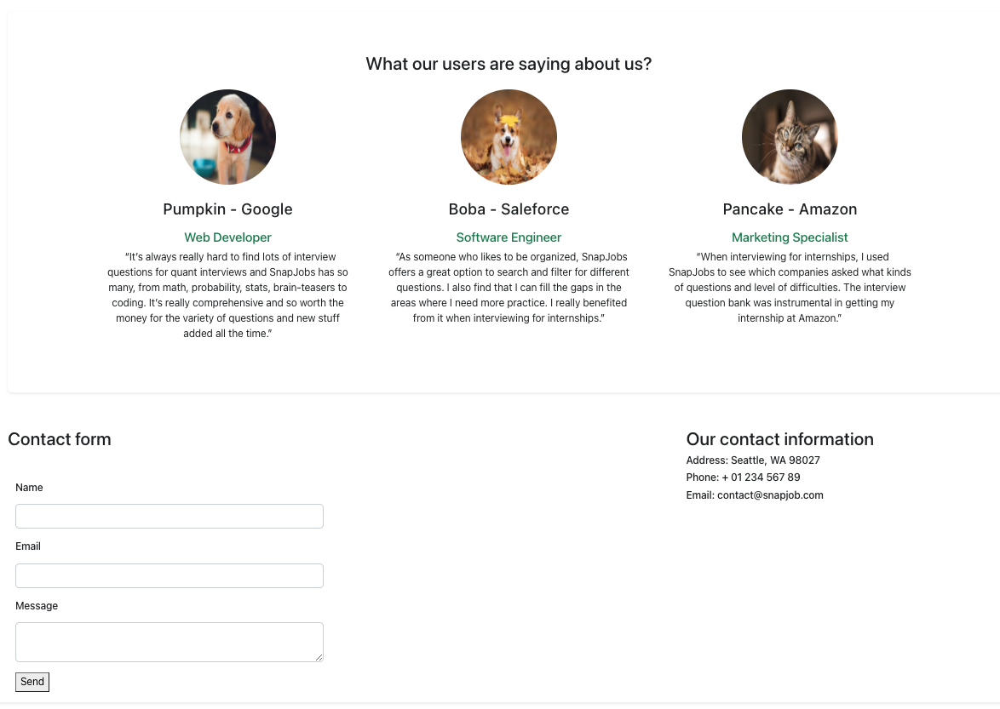
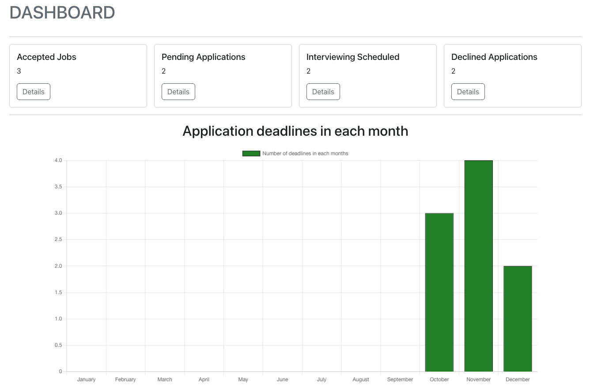
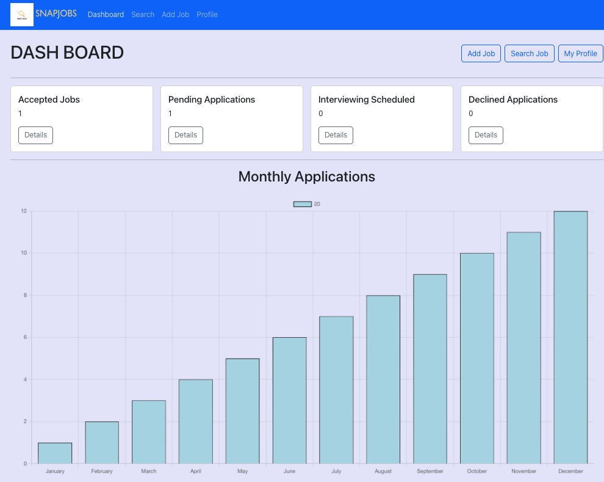
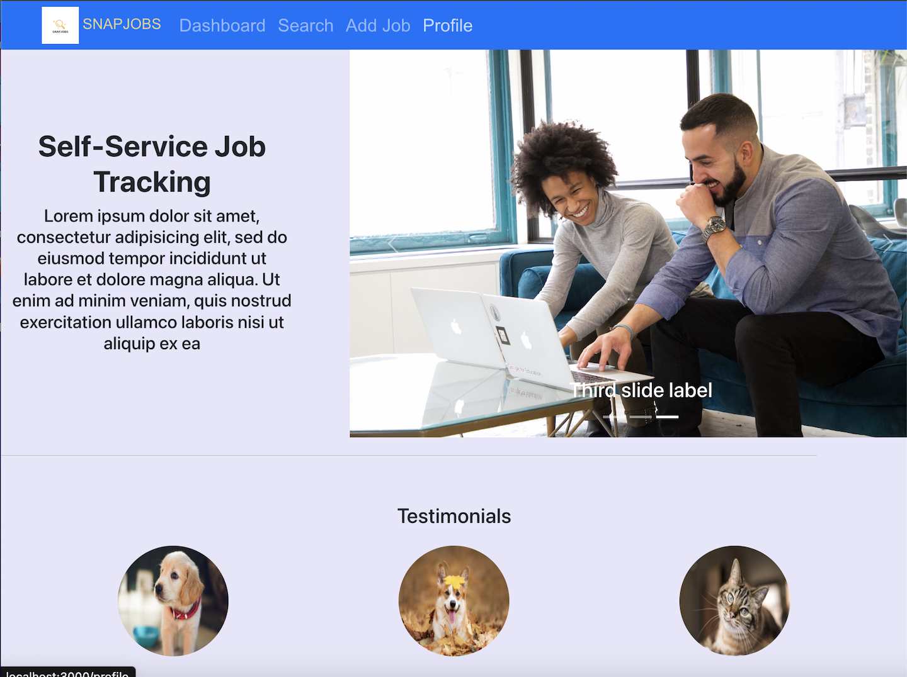
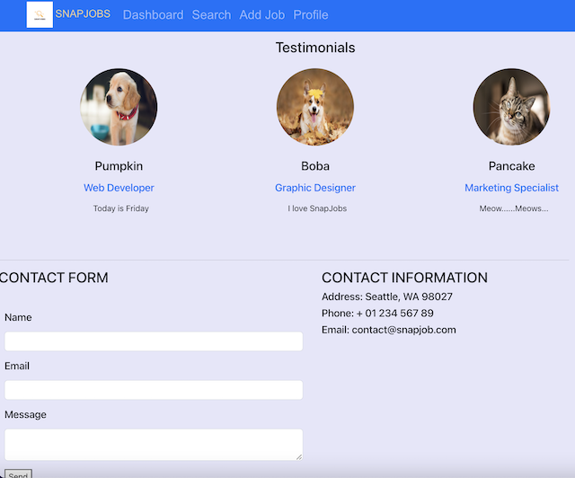
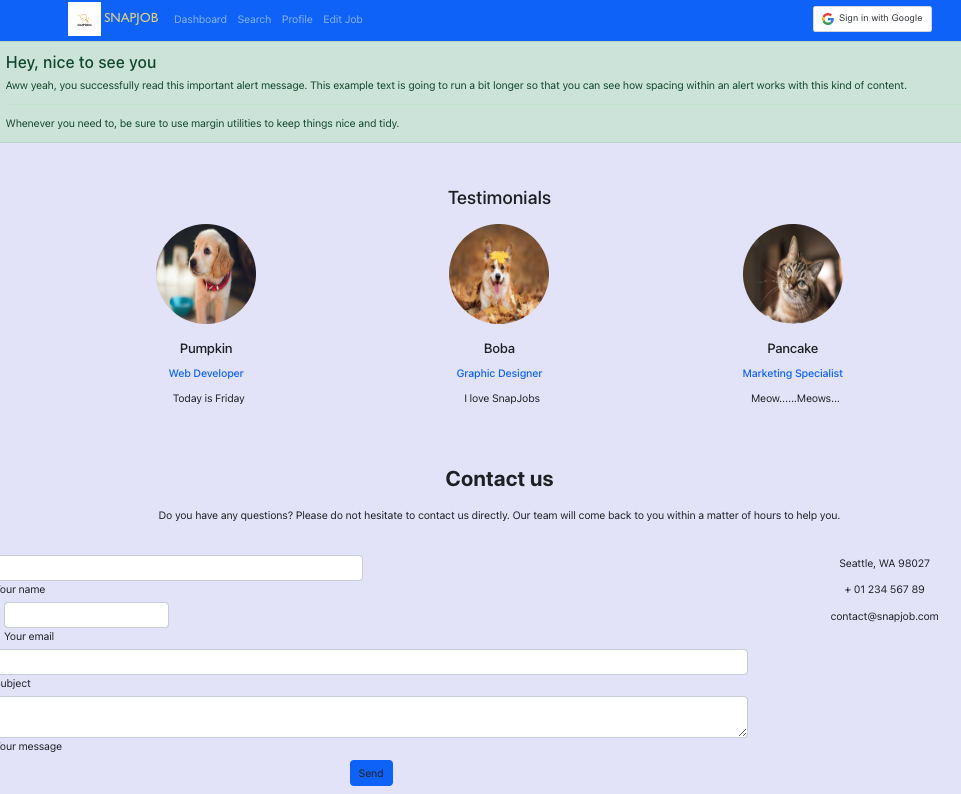
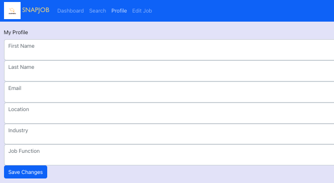
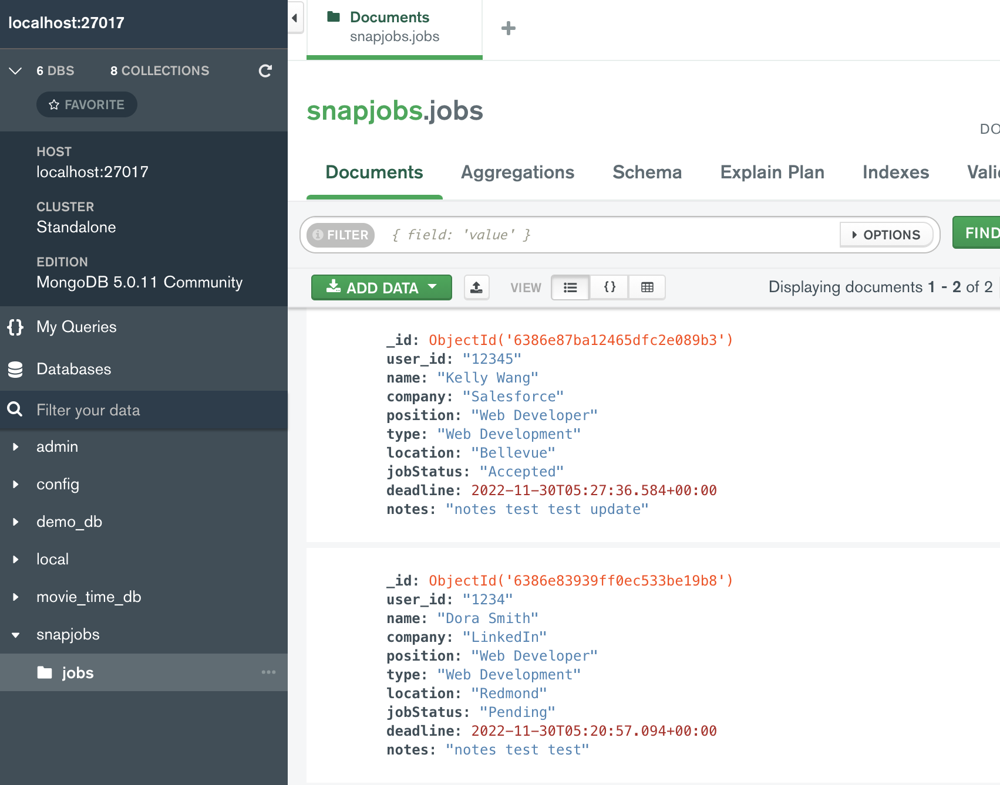

# Curent Arrangement of fronend router:

1. `/`: dashboard;
2. `/jobs/:id`: single job page;
3. `/search`: search page;
4. `/jobs/:id/edit`: edit page;
5. `/jobs/add`: add page;
6. `/profile`: profile;

# Current Arrangement of backend router:

1. `/`: apiGetJobs: get all jobs (for dashboard, and search page(default) )
2. `/company` ... etc : for search page;
3. `/job`: apiPost/Update/Delete, for edit page and add page
4. `/id/:id` : apiGetJobById: for single job page;
5. `/profile`: apiGetProfileByUser: for profile page (will pass in a userId)

# 12/14

Task1
1. Fix saveJob and deleteJob method for both frontend and backend.
2. Implement Google Authentication APIs. Remove the temporary login/logout page.
3. Fix profile page, enhance and validate updateProfile. Add conditionals to profile page, making the profile page to display create/update button accordingly. Add useCallback and useEffect hooks to persist values
4. Add conditionals to the Dashboard page, filter out the job applications related to current users. Add useCallback and useEffect hooks to persist values

Task2
1. Remake homepage and other pages for consistent styling
2. Finish dashboard with deadlines of applications in JSON fetched in collumn chart
3. Build page to give details for each accepted-jobs card, pending-jobs card, declined-jobs card, and interview card whenever user click 'Details' button in dashboard.

Note: For details in each card and data in collumn chart, I used the data of jobs instead of by user login. This feature I'd try to work on and improve

Task3
1. Update search page and use filter function for locations, also create text index in MongoDB Atlas for find query
2. Implement a pop-up calendar for users to select the date for editing
3. Correct some typos for both backend and frontend, e.g., use jobType instead of type
4. Organize uselsess files, style the pages, and check all the TODO list comments
5. Fix updateJob method in the frontend, add dependencies for useEffect and useCallback functions for correct re-rendering
6. Consolidate and merge all changes, deploy on Heroku and finish the troubleshooting for deployment

# 12/08

Task1
1. Build the search page for displaying all existing jobs and filtering to narrow the search
2. Rearrange the links on homepage to make it more straightforward for users to navigate
3. Distinguish routes for edit job and add job page, provide similar layouts but different functionalities
4. Revise hooks in AddJob.js to fill the current job information on the edit page

Task2
1. Partly build the Job.js component
2. Implement the register and login component
3. Build the profile's controller and daos
4. Work on google authentication and the user's controller and daos (in process)

Task3
1. Restyle Homepage page with banner with carousels, testimonials, and contact form and information
2. Build Dashboard page with components that call API to get data, make buttons that links to other pages
3. Provide responsive contact form for homepage
4. Continue to work on AcceptedJobsDetails.js, DeclinedJobsDetails.js, PendingJobsDetails.js, InterviewDetails.js
   whose purpose will provide details on job data
   
   
   

# 12/02

Task1

1. Initial setup for the directory and repo structure for SnapJobs frontend
2. Revise index.js and App.js to get the router working, and make sure the pages are working

Task2

1. Implement the AddJob.js component. This component supports the Edit Job page and Add job page and provides save/reset/delete functionality for both pages.
2. Implement the SingleJobPage.js component. This component will support the single page view in later iteration.
3. Implement the Profile.js component. This component supports the Profile page.
4. Implement the job.js service (JobDataService), provides connection with backend using axios.
5. Set up dummy data for testing of JobDataService and backend controller/DAOs..

Task3

1. Implement the Login.js component. This component supports user login wiht google sign-in
2. Implement the Homepage.js component with basic navbar, and div components as in proposal
3. Connect and test backend deployment on Heroku

## A few screenshots of upon completion

**FRONT-END**

**Responsive frontend**

**Example of working route**

**BACK-END**

**Objects are retrieved on mongoDB and test successfully with Insomnia**

